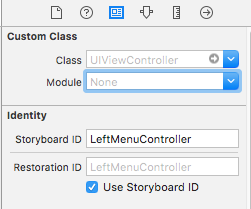

# DualSlideMenu

[](https://travis-ci.org/vinnyoodles/DualSlideMenu)
[](http://cocoapods.org/pods/DualSlideMenu)
[](http://cocoapods.org/pods/DualSlideMenu)
[](http://cocoapods.org/pods/DualSlideMenu)

Left and right slide menu to keep your main view clutter free


## Usage

To run the example project, clone the repo, and run `pod install` from the Example directory first. Then, run the example project and check out the example.

## Requirements

## Installation

DualSlideMenu is available through [CocoaPods](http://cocoapods.org). To install
it, simply add the following line to your Podfile:

```ruby
pod "DualSlideMenu"
```

Create a main view controller, which can be considered the home view of the app, and two other view controllers which will be the left and the right side menus. Then add an identifier for the three view controllers which will be used in the AppDelegate.



In your AppDelegate file, add the pod to the file 
```swift
import DualSlideMenu
```

and initialize and add the three view controllers to the container class using the identifers from above

```swift
var window: UIWindow?
var storyboard: UIStoryboard?


func application(application: UIApplication, didFinishLaunchingWithOptions launchOptions: [NSObject: AnyObject]?) -> Bool {
  window = UIWindow(frame: UIScreen.mainScreen().bounds)
    storyboard = UIStoryboard(name: "Main", bundle: nil)


    let leftView = storyboard?.instantiateViewControllerWithIdentifier("LeftMenuController")
    let rightView = storyboard?.instantiateViewControllerWithIdentifier("RightMenuController")
    let mainView = storyboard?.instantiateViewControllerWithIdentifier("MainController")

    let controller = ExampleViewController(mainViewController: mainView!, leftMenuViewController: leftView!, rightMenuViewController: rightView!)
    window!.rootViewController = controller
    window!.makeKeyAndVisible()
    return true
}

```

The width of display for the side menus can be changed by adding this line of code to your AppDelegate inside of the didFinishLaunchWithOptions method

```swift
controller.sideViewOffset = 200
//200 represents the width of the main view when the side menu is present
```


## Author

Vincent Le, vinnyoodles@gmail.com

## License

DualSlideMenu is available under the MIT license. See the LICENSE file for more info.
